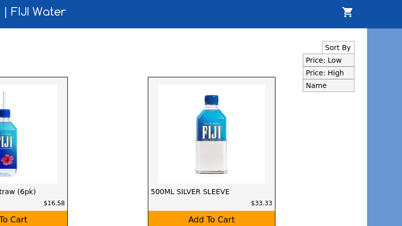
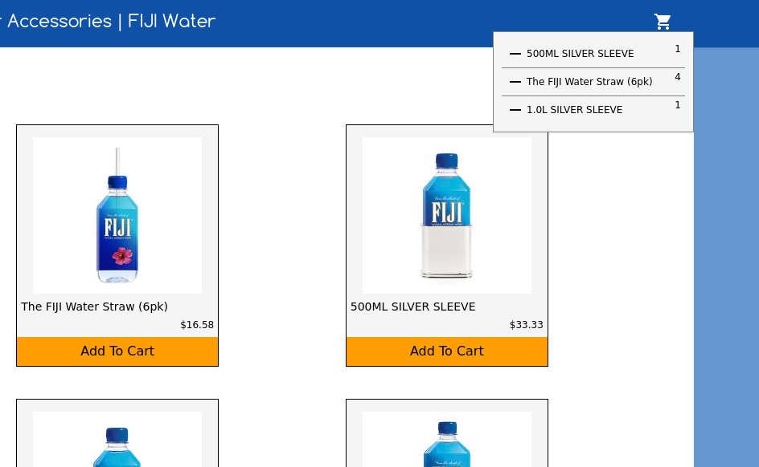

# Store Page Demo

[Live Site](http://brentluna.com/symphony)

This is an example of an e-commerce store's product page. 


## Technologies Used

- JavaScript 
- React.js
- Redux.js
- Ajax 

## Description 

Upon entering the page, I utilized ajax to hit an api and get the product info
for the page. I store that data on the client side using Redux, and render the
page using React Components. 

```javascript
export const fetchProducts = success => (
  $.ajax({
    method: 'get',
    url: 'http://sneakpeeq-sites.s3.amazonaws.com/interviews/ce/feeds/store.js',
    success, 
    error: () => console.log('Error in fetchAllProducts util')
  })
);
```

I added a "Sort By" feature to the product page that utilizes redux to keep
track of the current "Sort By" method, and sorts the products appropriately.

```javascript
const sortMap = {
  'Price: Low': (a, b) => {
    return Math.sign(a.msrpInCents - b.msrpInCents);
   },
  'Price: High': (a, b) => {
    return Math.sign(b.msrpInCents - a.msrpInCents);
  },
  'Name': (a, b) => {
    if (a.name > b.name) {
      return 1;
    } else if (a.name < b.name) {
      return -1;
    } else {
      return 0;
    }
  }
  
  
}
const mapStateToProps = state => {

  let sortedProducts = []; 
  if (state.products && state.products.products && state.products.products.length) {
    let sortType = sortMap[state.sort];
    sortedProducts = state.products.products.sort(sortType);
  }

  return({
    products: sortedProducts,
    sort: state.sort
  });
}
```


Along with the ability to sort the products, you can also filter them on
categories such as sleeves, straws, cufflinks, and less than $20. I do this
using redux to keep track of the user selected filters and then select the
products that match the selected filteres before they are sorted.

```javascript
let filteredProducts = [];
if (!Object.keys(state.filters).length) {
  filteredProducts = state.products.products;
}
for (let filter in state.filters) {
  
  if (filter === '1200') {
    let newProds = state.products.products.filter(prod => {
      return prod.msrpInCents < 1200; 
    }); 
    filteredProducts = filteredProducts.concat(newProds);
  } else {

    let newProds = state.products.products.filter(prod => {
      return prod.name.toLowerCase().indexOf(filter) !== -1
    });
    filteredProducts = filteredProducts.concat(newProds);
  }
}
sortedProducts = filteredProducts.sort(sortType);
```
I also added a client side cart, where you can click "Add to Cart" on a product
and it will be viewable via a drop down from the cart icon. I utilized redux to
manage actions to update the cart.


## Future Directions 
- Utilize React Router and create a product page component where you can view
  more on each product

- Add jest unit testing

- Polish up the design


